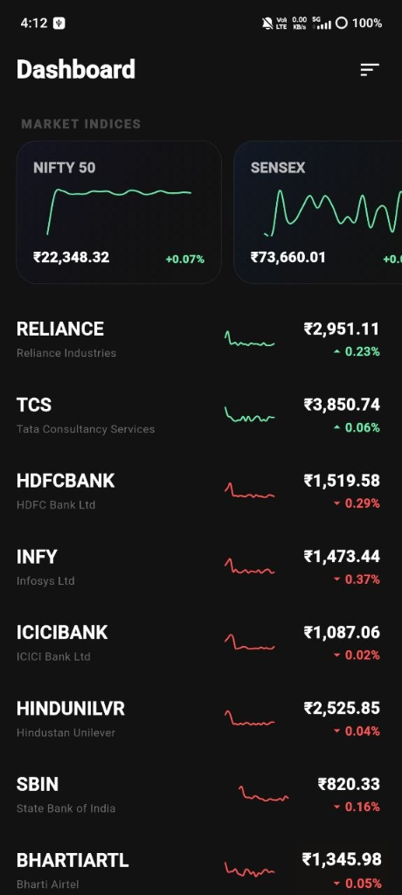
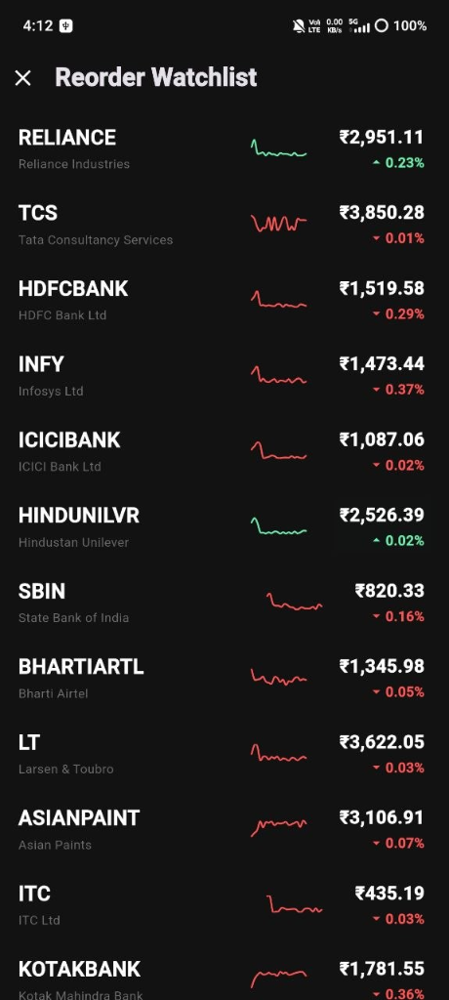
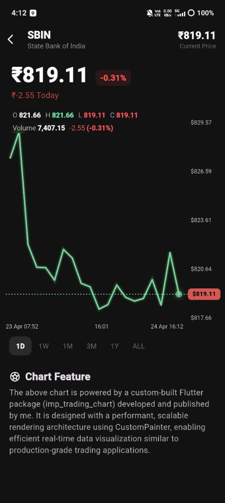

# 🚀 MarketPulse

A high-performance Flutter application that demonstrates a scalable **BLoC-based architecture** for managing a stock watchlist with real-time updates, reorder functionality, and advanced chart visualization.

## 🎯 Objective

The primary goal of this project is to:
*   Implement watchlist reordering using **BLoC architecture**.
*   Ensure **Clean Architecture** and separation of concerns.
*   Deliver a smooth, responsive, and performance-optimized UI experience with **production-grade polish**.

---

## 📸 Screenshots

<p align="center">
  
  
  
</p>

---

## ✨ Key Features

### 📊 Watchlist Management
Display a list of stocks with:
*   Symbol & Name
*   Live price updates
*   Real-time percentage change
*   **Mini sparkline charts** for immediate trend visualization.

### 🔄 Reorder Functionality
*   **Intuitive Drag & Drop**: Hold any stock card in the **Reorder Screen** (accessible via the sort icon in the Dashboard) to drag and drop it into a new position.
*   **Fully Managed**: State is updated via **BLoC events** and immutable state logic.
*   **Optimized Performance**: Leverages `SliverReorderableList` with localized rebuilds to ensure 60FPS interactions.

### ⚡ Real-Time Simulation
*   Lightweight **Simulation Service** mimics live market updates at 1000ms intervals.
*   **Batched updates** reduce unnecessary UI rebuilds, processing multiple price changes in a single tick.
*   Supports both Stocks and Market Indices (NIFTY 50, SENSEX).

### 📈 Chart Integration (Custom Package)
Integrated a custom Flutter package developed to handle high-frequency trading data:
*   👉 **[imp_trading_chart](https://pub.dev/packages/imp_trading_chart)** (developed & published by me)
*   **Features**:
    *   `CustomPainter`-based rendering for maximum performance.
    *   Efficient handling of real-time data ticks.
    *   Supports both mini sparkline charts and full candlestick charts with OHLC data.

---

## 🧠 Why BLoC?

BLoC was chosen over simpler state management solutions to ensure:
*   **Clear separation** between UI and business logic.
*   **Predictable and testable** state transitions.
*   **Scalability** for handling real-time data streams efficiently.

This approach aligns with production-grade application architecture used in large-scale financial platforms.

---

## ⚖️ Design Trade-offs

*   **Simulation Depth**: The real-time simulation is intentionally lightweight to avoid UI performance degradation during rapid market movements.
*   **Data Density**: Mini charts are optimized with a limited number of data points (20) to ensure buttery-smooth scrolling in the main list.
*   **Entity Separation**: Indices (NIFTY, SENSEX) are kept separate from the stock watchlist to maintain clean data modeling and section-specific rebuild logic.

These decisions balance **realism with high performance** and long-term maintainability.

---

## 🧱 Architecture

The application follows a **Clean Architecture + Feature-first** structure:

```text
Presentation (UI + BLoC)
      ↓
Domain (Entities + Repository Interfaces)
      ↓
Data (Models + Repositories + DataSources)
```

---

## ⚡ Performance Optimizations

*   ✅ **Batch Emits**: Simulation layer batches multiple updates into a single event.
*   ✅ **Isolated Rebuilds**: Specialized sub-widgets for price and charts ensure only the necessary pixels are redrawn.
*   ✅ **RepaintBoundary**: Isolated complex chart rendering to prevent unnecessary GPU repaints.
*   ✅ **GC Optimization**: Eliminated redundant list copies during state transitions.
*   ✅ **Candle Capping**: Data history is capped at 20 units to maintain rendering efficiency over time.

---

## 📦 Project Structure

```text
lib/
├── core/
│   ├── services/      # Simulation & background tasks
│   ├── utils/         # Formatters & constants
│
├── features/
│   └── watchlist/     # Core feature module
│       ├── data/      # Models & Mock Data
│       ├── domain/    # Entities & Interfaces
│       ├── presentation/ # BLoC & Widgets
│
├── shared/
│   └── widgets/       # Global UI components
│
├── app.dart           # App configuration & Theme
└── main.dart          # Entry point
```

---

## ▶️ Getting Started

1. **Clone the repository**:
```bash
git clone https://github.com/rahul-cse-25/trading_reorder_simulation.git
```

2. **Install dependencies**:
```bash
flutter pub get
```

3. **Optimized Build (Recommended)**:
To generate a single, highly-optimized APK with the smallest possible size:
```bash
# Step 1: Clean project
flutter clean
flutter pub get

# Step 2: Build optimized APK
flutter build apk \
  --release \
  --obfuscate \
  --split-debug-info=build/debug-info \
  --tree-shake-icons
```

### 🧠 Build Flags Explained:
*   `--release`: Builds optimized production APK (removes debug code).
*   `--obfuscate`: Renames classes/functions to protect code and reduce size.
*   `--split-debug-info`: Moves debug symbols outside the APK to save space.
*   `--tree-shake-icons`: Removes all unused icons from font files (saves ~300KB).

---

## 📲 Quick Install

For immediate testing, you can find the pre-built release APK in the root directory:
👉 **[MarketPulse_v1.0.apk](MarketPulse_v1.0.apk)**

---

## 🏁 Conclusion

This project demonstrates:
*   Strong understanding of **scalable Flutter architecture**.
*   Advanced state management using **BLoC**.
*   **Performance-driven UI design** with fine-grained rebuild control.
*   Real-world **product thinking** through simulation and custom chart integration.

The implementation focuses not only on solving the assignment but also on building a system that reflects **production-level engineering practices**.

---

## 📎 Repository

**GitHub**: [trading_reorder_simulation](https://github.com/rahul-cse-25/trading_reorder_simulation.git)
